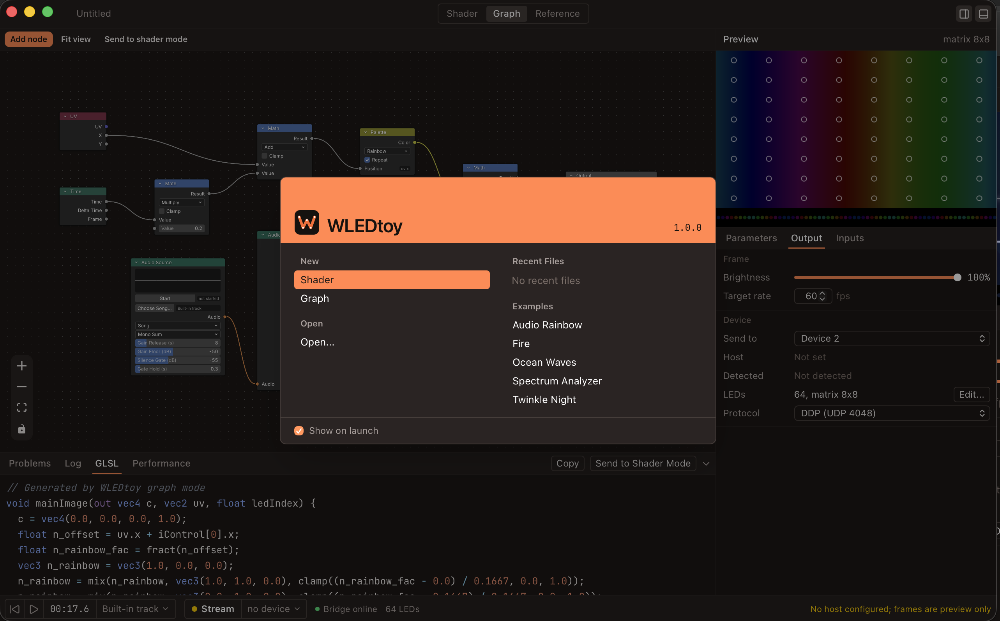

# WLEDToy

<p align="center">
  
</p>

Live shader and node-graph playground for addressable LEDs. Write GLSL or build Blender-style node graphs, react to audio and MIDI, preview on a virtual strip or matrix, and stream to WLED over DDP, DNRGB, Art-Net or sACN.

**Live Demo:** [https://music-engine.github.io/wled-toy](https://music-engine.github.io/wled-toy)

WLEDToy is influenced by [ShaderToy](https://www.shadertoy.com/), [TouchDesigner](https://derivative.ca/), Blender's [Shader Editor](https://docs.blender.org/manual/en/latest/render/shader_nodes/introduction.html), and [WLED](https://github.com/Aircoookie/WLED).

WLEDToy is a development tool built for Music Engine, a customizable live audio-reactive media player that renders to screens, addresable LEDs, and IoT devices. It's available as a standalone tool because it's useful on its own for live-testing WLED devices, measuring their performance, and writing custom WLED shaders in a node-graph editor for custom lighting projects.

## Installation

Requirements:
- [Node.js](https://nodejs.org/) 20 or later
- [Rust](https://www.rust-lang.org/) 1.80 or later

You also need to have `git` and `pnpm` installed. You can install `pnpm` with:

```bash
npm install -g pnpm
```

Clone the repository and install dependencies:

```bash
git clone https://github.com/Music-Engine/wled-toy.git
cd wled-toy
pnpm install
```

Building the application:

```bash
pnpm run tauri build
```

## Releases

The release version is the `version` in `package.json`. Pushing a change to `package.json` on `main` runs `.github/workflows/release.yml`. If no release is published for `v<version>` yet, it builds Linux (deb, rpm, AppImage), Windows (MSI, NSIS) and macOS (dmg) bundles for amd64 and arm64 and attaches them to a draft GitHub release. Review the draft under Releases and publish it; publishing creates the `v<version>` tag.

```bash
npm version minor --no-git-tag-version
git commit -am "chore(release): bump version"
git push origin main
```

Running the workflow manually from another branch, or for a version that is already published, builds the same bundles as workflow artifacts without touching a release. Builds are not code signed; macOS builds carry an ad-hoc signature only.

## Features
- Live GLSL shader editor with instant preview on a virtual LED strip or matrix
- Node-graph editor for building shaders without writing code
- Audio and MIDI input for live-reactive shaders
- Stream to WLED over DDP, DNRGB, Art-Net or sACN
- Export shaders to WLED JSON format for use in WLED's custom effects
- Cross-platform desktop application for Windows, macOS, and Linux
- Open-source and free to use
